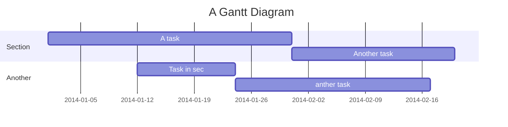

# My Top 100 Leetcode (With Explaination)

## Who might be interested in this repo

This repo is for those beginners, fresh to leetcode and be afraid of reading lots of code

## TL;DR

Instead of a tutorial or sth like that, I am building a  world, a world let me explore the beautiful of programming language, data structure and algorithm. 

A travel of self-talking and thinking.

A logbook recorded how I think.

This repository include my favorite leetcode question and the way I think. My principal is, write a snippet of readable code while the performance is great, too.

I sincerely hope you like it!


## 

## Leetcode Question


| #  | Title  | Language   | Difficulty  |  Tag |
|---|---|---|---|---|
| 1  | [Two Sum](https://leetcode.com/problems/two-sum/) | Python | Easy | Array
  |   |   |   |
|   |   |   |   |   |
|   |   |   |   |   |
|   |   |   |   |   |
|   |   |   |   |   |
|   |   |   |   |   |
|   |   |   |   |   |


> “You've baked a really lovely cake, but then you've used dog shit for frosting.” 
 [name=Steve Jobs]


```gherkin=
Feature: Shopping Cart
  As a Shopper
  I want to put items in my shopping cart
  Because I want to manage items before I check out

  Scenario: User adds item to cart
    Given I'm a logged-in User
    When I go to the Item page
    And I click "Add item to cart"
    Then the quantity of items in my cart should go up
    And my subtotal should increment
    And the warehouse inventory should decrement
```

> Read more about Gherkin here: https://docs.cucumber.io/gherkin/reference/

User flows
---
```sequence
Alice->Bob: Hello Bob, how are you??
Note right of Bob: Bob thinks
Bob-->Alice: I am good thanks!
Note left of Alice: Alice responds
Alice->Bob: Where have you been?
```

> Read more about sequence-diagrams here: http://bramp.github.io/js-sequence-diagrams/

Project Timeline
---


> Read more about mermaid here: http://knsv.github.io/mermaid/

## Appendix and FAQ

:::info
**Find this document incomplete?** Leave a comment!
:::

###### tags: `Leetcode` `Learning`
